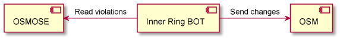

* Introduction
* Implementation
* Running the BOT
* Run parameters
  * Required parameters to provide
  * Optional parameters to provide

## Introduction
The purpose of this BOT is to fix issues with duplicated inner ring geometries. Such cases are detected i.e. by the Osmose Rule 1170 Class 1 Double inner 
polygon (the geometry of the inner of the multipolygon is duplicated. One in relation without tag and another with tags not part of the relation). After the 
data verification, it appears that they are mainly coming from automatic imports. According to its 
[OSM wiki documentation](https://wiki.openstreetmap.org/wiki/CanVec#Issues_found_in_OSM) the issue is already known, it is mentioned there as Duplicate land features issue.

According to OpenStreetMap wiki, if the inner way represents something itself (e.g., a forest with a hole where the hole is a lake), 
then the inner way must be tagged as such.

## Implementation

As an BOT input data, violations from [OSMOSE](http://osmose.openstreetmap.fr/en/issues/open?country=canada_alberta&item=1170&source=&class=1&username=&bbox=) (rule id 1170) are taken, and must be provided as input parameter. For each violation, data from OSM is fetched 
and violations are one more time verified.

Following checks are executed:
* both ways are closed and have the same nodes (direction of way digitization and starting node can be different),
* duplicating way should have tags,
* duplicating way is not member of any relation,
* inner ring way should have no tags,
* inner ring way is member of only 1 relation (the one from Osmose violation),
* optional: relation and duplicating way should have required "source" tag (e.g. "source=CanVec 8.0 - NRCan).

When violation is confirmed by BOT, then data modification is generated. Data modification, is understood as:
* copying tags from way which does not belong to any relation to the way which is a member of violating relation,
* removing way which does not belong to any relation.

## Running the bot
Inner ring bot can be run using following command:
>        ./gradlew bootRun \
>           --args=" \
>               --run.parameters.osm-discussion-page=osm-discussion-page \
>               --run.parameters.osm-wiki-documentation-page=osm-wiki-documentation-page \
>               --run.parameters.open-street-map-api.credentials.token=user-token \
>               --run.parameters.open-street-map-api.credentials.token-secret=user-token-secret \
>               --run.parameters.open-street-map-api.credentials.consumer-key=user-consumer-key \
>               --run.parameters.open-street-map-api.credentials.consumer-secret=user-consumer-secret \
>               --run.parameters.path-to-violations-file=user-file-with-violations \

About other possible parameters, please read `Input parameters` section.

## Run parameters

> **_NOTE_** Please pay attention, that `osm-discussion-page` and `osm-wiki-documentation-page` require acceptance of the OSM community, so before running the BOT, ensure that these parameters are accepted.

### Required parameters to provide
Following run parameters are required to provide by the user:
* The `osm-discussion-page` is the link to web page with the discussion about possible BOT run on certain area
>   --run.parameters.osm-discussion-page=osm-discussion-page

* The `osm-wiki-documentation-page`is the link to web page with the BOT documentation for certain area
>   --run.parameters.osm-wiki-documentation-page=osm-wiki-documentation-page

* The `consumer-key` is what identifies the consumer (can be generated after logging to OSM account)
>   --run.parameters.open-street-map-api.credentials.consumer-key=user-consumer-key
 
* The `consumer-secret` is the consumer secret used to request access
>   --run.parameters.open-street-map-api.credentials.consumer-secret=user-consumer-secret

Parameters `consumer-key` and `consumer-secret` are required to gain authorized access to the protected resources on the OSM server. 
Detailed instruction how to receive those parameters can be found on [OSM wiki page](https://wiki.openstreetmap.org/wiki/OAuth#OAuth_1.0a)

* The `token` identifier. It is generated once the consumer completes the authorization process
>   --run.parameters.open-street-map-api.credentials.token=user-token

* The `token-secret` shared secret value. It is generated once the consumer completes the authorization process
>   --run.parameters.open-street-map-api.credentials.token-secret=user-token-secret

Parameters `token` and `token-secret` are issued to the consumer by the service provider once the consumer completes the authorization. 
The `token` defines the access rights of the consumer to the resources and is included in each API request.
Procedure how to obtain `token` and `token-secret` is described in the method [shouldRetrieveConsumerTokenAndSecret](src/test/java/osm/bots/rings/inner/duplicates/utils/UserAuthorizationTest.java).
There is also second method [shouldCheckIfTokenAndTokenSecretWorks](src/test/java/osm/bots/rings/inner/duplicates/utils/UserAuthorizationTest.java) which can be used 
for verification if `consumer-key`, `consumer-secret`, `token` and `token-secret` have been successfully authorized.

* The `path-to-violations-file` is a path to a JSON formatted file, with violations downloaded from 
  [OSMOSE](http://osmose.openstreetmap.fr/en/issues/open?country=canada_alberta&item=1170&source=&class=1&username=&bbox=)
>   --run.parameters.path-to-violations-file="path_to_violations"
> 
### Optional parameters to provide
Following run parameters are optional, but it is not recommended, to change their default values:

* The `open-street-map-api.url` is the URL address of OSM Editing API, which is used to get data for violations validation and also all modifications created 
  by BOT are sent to this URL. Recommended value of that property is: `https://api.openstreetmap.org/api/0.6/`
>   --run.parameters.open-street-map-api.url=https://api.openstreetmap.org/api/0.6/

* The `upload-fixes` flag determines if changes should be uploaded to OSM Editing API, or just calculated and logged.
  When set to `false`, all `run.parameters.open-street-map-api.credentials.*` parameters are skipped
>   --run.parameters.upload-fixes=false

* The `max-violations-per-changeset` is the amount of modifications sent to OSM per changeset (default value is 50)
>   --run.parameters.max-violations-per-changeset=50  

* The `verifier.ways-have-matching-nodes.active` informs BOT, if it should verify that both ways have the same nodes (default value is true).
>   --run.parameters.verifier.ways-have-matching-nodes.active=true

* The `verifier.duplicating-way-has-tags.active` informs BOT, if it should verify that duplicating way has any tags (default value is true).
>   --run.parameters.verifier.duplicating-way-has-tags.active=true

* The `verifier.duplicating-way-is-not-member-of-any-relation.active` informs BOT, if it should verify that duplicating way is not a member of any relation 
  (default value is true).
>   --run.parameters.verifier.duplicating-way-is-not-member-of-any-relation.active=true

* The `verifier.inner-ring-way-has-no-tags.active` informs BOT, if it should verify that inner ring way has not tags (default value is true).
>   --run.parameters.verifier.inner-ring-way-has-no-tags.active=true

* The `verifier.inner-ring-way-is-only-member-of-violating-relation.active` informs BOT, if it should verify that inner ring way is a member of only violating 
  relation (default value is true).
>   --run.parameters.verifier.inner-ring-way-is-only-member-of-violating-relation.active=true

* The `verifier.source.active` informs BOT, if it should include source tag into violations filtering procedure (default value is false).
>   --run.parameters.source.verifier.active=false

* The `verifier.source.tag-values` informs BOT, what values of source tag should be accepted as valid violations. Values are provided as array elements. Please notice that for each country these values vary, so before run please verify them.
>   --run.parameters.source.tag-values`=["NRCan-CanVec-10.0","NRCan-CanVec-11.0"]
